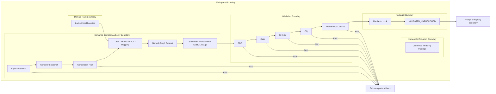

# Deterministic Semantic Kernel Architecture

There is deliberately no repair arrow from a validation failure to providers,
an LLM, candidates or Domain Packs. Staging is under `tmp/compilation`; only a
fully verified closed set is atomically committed. The kernel accepts explicit
Domain Pack roots and package resources and never uses `repository_root`.
