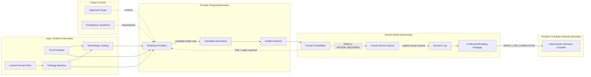

# Evidence-Grounded Modeling Architecture

Prompt 4 turns approved requirements and untrusted evidence into a reviewed,
deterministic compiler input. Solid arrows carry artifacts; dashed arrows are
control decisions. The boundaries are authority boundaries, not process names.

KG-IR is evidence, never an ontology. Providers cannot write workspaces or own
final IDs. Formal prevalidation cannot claim reasoning or CQ execution. Human
review is the only confirmation authority in this phase. The Confirmed
Modeling Package crosses into Prompt 5 but contains no authoritative semantic
syntax and triggers no compiler, publication, GraphDB, OMS, ODS, or OSS action.
