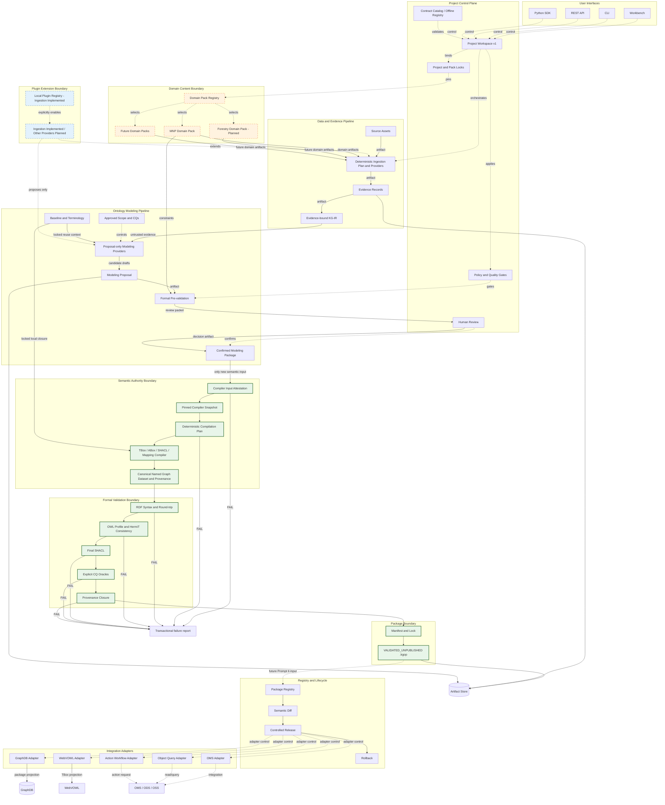

# Ontology Toolchain Target Architecture

This is the target product architecture. Shaded boundaries distinguish the
deterministic semantic authority, plugin extension points, and domain content.
Solid arrows carry governed artifacts; dashed arrows carry control or adapter
requests. Prompts 2–5 implement the Contract Kernel, local Domain Pack Registry,
Project Workspace, local Plugin Registry, evidence-bound ingestion, and the
evidence-grounded modeling/review control plane through a deterministic
compiler-ready package, then the deterministic semantic kernel and portable
`VALIDATED_UNPUBLISHED` package boundary. The remaining lifecycle and interface
boxes are not implied to be implemented by their presence in this diagram.

## Boundary rules

- **Control flow** coordinates providers, policies, reviews, registries, and
  adapters; it does not create formal semantics by itself.
- **Artifact flow** moves immutable or versioned evidence, proposals, decisions,
  compilation inputs, outputs, reports, and packages.
- **Semantic authority** begins only at a reviewed Confirmed Modeling Package.
  The deterministic kernel owns formal generation and validation.
- **Plugin extension** may ingest, extract, propose, store, visualize, or
  integrate, but cannot bypass authority gates.
- **Domain content** is supplied by Domain Packs. No domain pack becomes the
  core compiler or a universal ontology.

## Prompt 2–5 implemented slice

The Contract Catalog and all public schemas are package resources accessed via
`importlib.resources`; they do not depend on the repository root or current
working directory. Registry resolution is package-local and offline. Formal
Domain Pack manifests are data-only, validated against executable content and
path escape, and locked to exact bytes and dependency closure. Project
Workspace v1 transactionally creates the filesystem boundary and binds its
Project Manifest to the Contract Catalog and exact Pack locks.

Prompt 3 activates only the `sources`, `artifacts/evidence`, `artifacts/ir`, and
`artifacts/validation` ingestion paths. The Source Store is content-addressed;
the deterministic planner binds provider snapshots; Core binds every accepted
observation to a SourceLocator, EvidenceRecord, and TransformationRecord before
building KG-IR. Structural quality can pass, require review, or fail. Image and
WAV support is metadata-only, while unsupported video, non-WAV audio, scanned
documents, and unavailable semantic providers remain unresolved or require
review without invented text.

Prompt 4 activates descendants under the existing modeling build, proposal,
review, and confirmed artifact roots. Approved Scope/CQs and a locked baseline
control Plugin API 1.1 proposal providers; Core normalizes closed candidates and
prevalidates them; humans decide through a replayable append-only log; and only
a non-RDF `READY_FOR_COMPILATION` package crosses the review boundary. The
package and release-registry authorities remain untouched.

Prompt 5 attests only the current confirmed package and its closed Workspace
authorities, snapshots the compiler and pinned local ROBOT/HermiT bundle, and
binds explicit versions and finite limits into a deterministic plan. The same
Domain-Pack-neutral kernel compiles TBox, ABox, safe SHACL Core, MappingPlan,
named graphs, provenance, audit, and evidence lineage. RDF, OWL, SHACL,
executable CQ oracles, provenance closure, package integrity, and reproduction
are fail-closed gates. Package commit is transactional and produces only
`VALIDATED_UNPUBLISHED`; no failure edge returns to providers, candidates, an
LLM, or a Domain Pack for automatic repair.

No live LLM, OCR/vision/ASR/video understanding, semantic diff, automatic SemVer
classification, Package Registry rewrite, controlled publication, activation
rewrite, REST, Workbench replacement, Forestry content, or generic GraphDB
backend is claimed. See `plugin-driven-ingestion-architecture.md` for Prompt 3,
`evidence-grounded-modeling-architecture.md` for Prompt 4, and
`deterministic-semantic-kernel-architecture.md` for Prompt 5.
