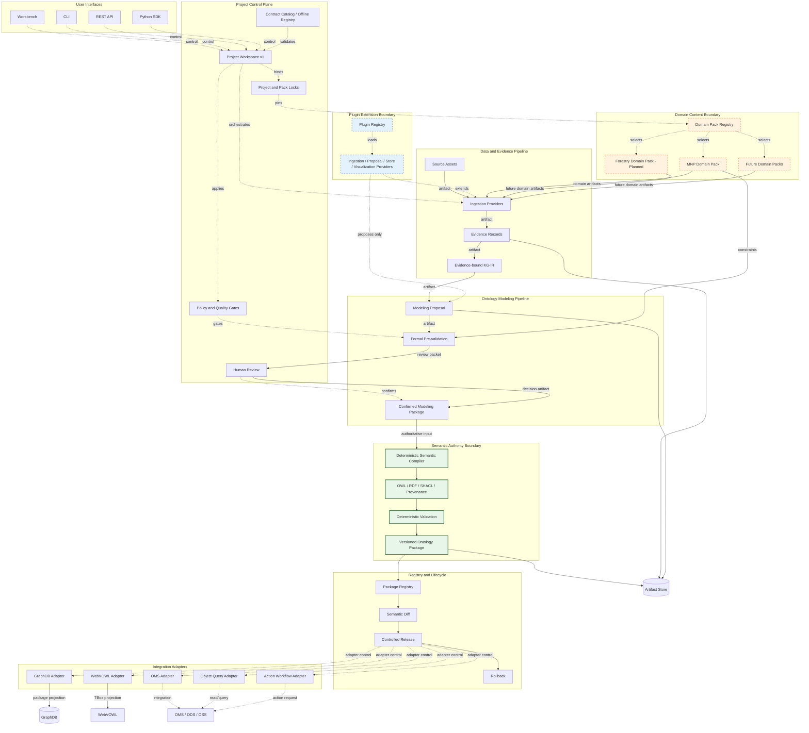

# Ontology Toolchain Target Architecture

This is the target product architecture. Shaded boundaries distinguish the
deterministic semantic authority, plugin extension points, and domain content.
Solid arrows carry governed artifacts; dashed arrows carry control or adapter
requests. Prompt 2 implements the Contract Kernel, local Domain Pack Registry,
and Project Workspace control-plane foundation. The remaining target boxes are
not implied to be implemented by their presence in this diagram.

## Boundary rules

- **Control flow** coordinates providers, policies, reviews, registries, and
  adapters; it does not create formal semantics by itself.
- **Artifact flow** moves immutable or versioned evidence, proposals, decisions,
  compilation inputs, outputs, reports, and packages.
- **Semantic authority** begins only at a reviewed Confirmed Modeling Package.
  The deterministic kernel owns formal generation and validation.
- **Plugin extension** may ingest, extract, propose, store, visualize, or
  integrate, but cannot bypass authority gates.
- **Domain content** is supplied by Domain Packs. No domain pack becomes the
  core compiler or a universal ontology.

## Prompt 2 implemented slice

The Contract Catalog and all public schemas are package resources accessed via
`importlib.resources`; they do not depend on the repository root or current
working directory. Registry resolution is package-local and offline. Formal
Domain Pack manifests are data-only, validated against executable content and
path escape, and locked to exact bytes and dependency closure. Project
Workspace v1 transactionally creates the filesystem boundary and binds its
Project Manifest to the Contract Catalog and exact Pack locks.

The `sources`, evidence, IR, proposal, review, confirmed, build, validation,
package, and registry directories are boundary reservations only. Prompt 2
does not implement multimodal ingestion, KG-IR, an LLM provider, a new review
experience, a compiler rewrite, final package assembly, semantic diff, REST,
Workbench replacement, Forestry content, or a generic GraphDB backend.
