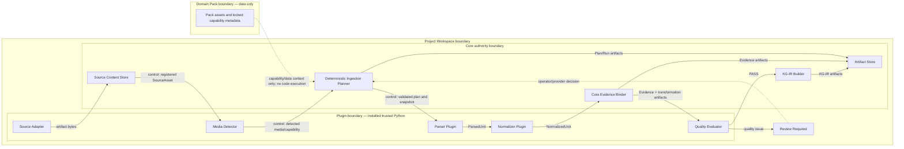

# Plugin-driven evidence-bound ingestion architecture

Solid arrows show control or artifact flow as labeled. Core alone assigns
Source/Evidence/KG-IR/artifact identities and commits formal files. Plugin code
cannot obtain a Workspace writer. Domain Packs do not carry executable plugin
code. Review does not turn KG-IR into ontology authority; it determines whether
later processing or a future provider is required.

The operation lock is process-external and stored under `tmp/locks`; its PID
and nonce are operational metadata excluded from semantic hashes. Staging is
non-authoritative until the four formal artifact directories commit.
