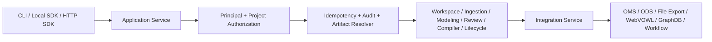
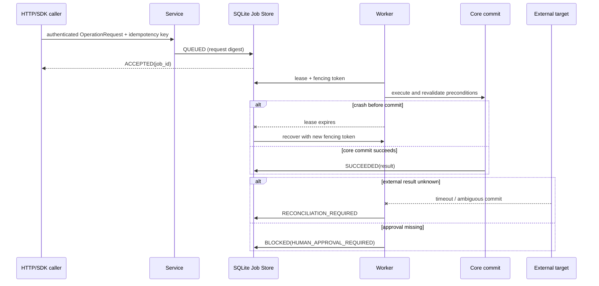

# Prompt 7: unified services and integrations

The 0.7 application boundary is `kg_mnp.services.ApplicationService`. The
local CLI, `LocalClient`, `HTTPClient`, and FastAPI routes all construct an
explicit `OperationRequest` and call the same operation catalogue. No API
route shells out to the CLI and no SDK parses CLI output.

The service authenticates bearer credentials from the local `TokenStore`,
checks permissions and project scope, records an audit event, and either
executes an inline read/write or creates a durable job. Client-supplied
reviewer, role, approval, quorum, and system-actor fields are rejected.
Human approval is derived from the authenticated principal and operation
policy; service accounts cannot satisfy human approval operations.

## Request flow

## Durable job flow

The environment pointer remains a control-plane selection. It is not an
external deployment receipt. GraphDB deployment has its own
`DeploymentBinding`/`IntegrationReceipt`, and workflow outbox enqueue is not
business execution success.

## Boundaries handed to P8

P8 can consume the operation catalogue, project handles, job records, review
records, package/release metadata, desired-versus-observed deployment fields,
and explicit OMS/ODS pagination. P7 does not build a Workbench UI.
