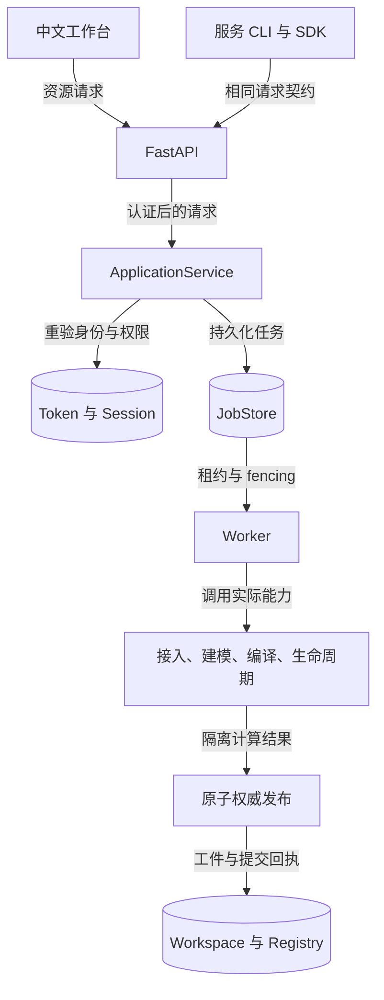
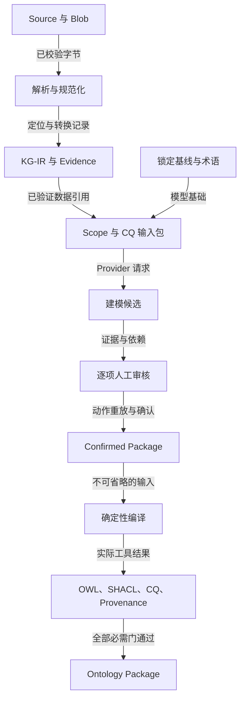
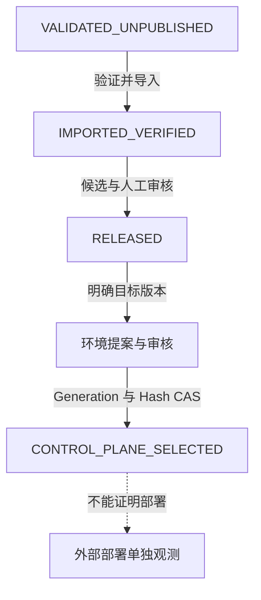
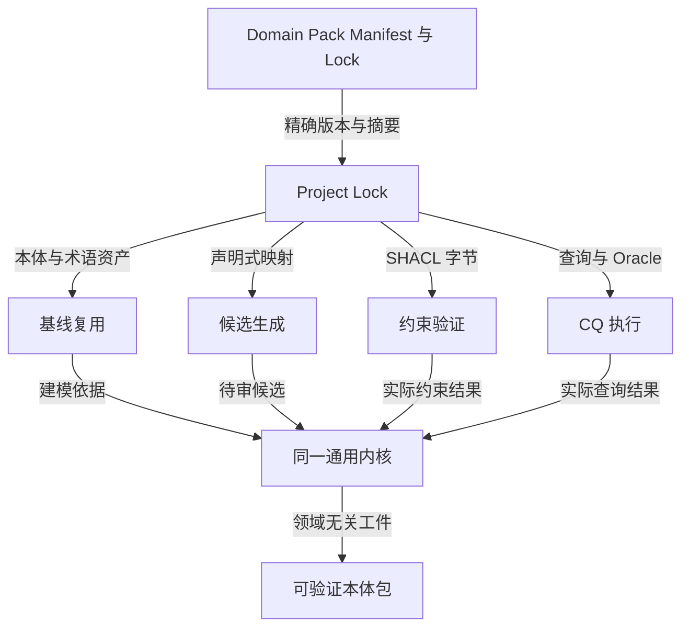

# 工具链架构与权威边界

这里描述源码中的逻辑模块，不把模块画成尚不存在的独立微服务。运行入口是同源 API 与 Worker；二者复用同一 ApplicationService 和语义内核。

## 1. 总体层次

服务层负责身份、资源归属、类型化请求和执行上下文；内核负责实际领域无关操作。客户端不能以 reviewer_roles、approved 或任意服务器路径替代服务器权威。GraphDB 不在本地主链路的必需依赖中。

实现：`src/kg_mnp/api/app.py`、`services/facade.py`、`jobs/store.py`、`jobs/worker.py`、`services/execution.py`。

## 2. 数据、建模、审核与编译工件流

Provider 输出不是批准。Recorded Output 的 Prompt / Response 来自上传 Source 的真实字节摘要，不冒充在线模型。修改候选产生新 revision；未批准、被拒绝依赖和未解决阻断不能进入确认包。

编译计划绑定确认包、编译器快照和明确 Query / Oracle。CQ 的结构覆盖与执行验证分别记录；空 Oracle 不能变成通过。

实现：`ingestion/`、`modeling/control_plane/`、`semantic_kernel/`；应用适配：`services/sources.py`、`services/modeling.py`、`services/compilation.py`。

## 3. Package、Release 与 Pointer 是不同对象

这不是同一对象的自动状态升级。Release 引用不可变 Package；环境 Pointer 引用 Release。回滚只能指向已成功激活的明确历史目标，不能用清空 Pointer 代替。

后续 Release 必须闭合实际语义 Diff、版本兼容、Impact 和 Regression。消费者查询调用隔离只读执行器；新增消费者契约不能被旧回归报告遗漏。审核按每人最新决定重放，撤回的批准不累计人数。

激活前重新检查 Package / Release / Attestation 文件摘要，并比较提案自身的基准 Pointer、调用方期望值和当前权威。指针变化不会修改 Package 或 Release。

实现：`lifecycle/`、`services/lifecycle.py`、`integrations/object_query.py`。

## 4. 领域包与通用核心

领域差异保存在数据、IRI、约束、映射和查询中，不通过核心或前端的 Pack ID 分支实现。Minimal / MNP 资产保持；Forestry 0.2.0 是明确标注 EXPERIMENTAL 的合成示例，不代表实地效果。

## 提交与恢复

写操作在完整隔离 Workspace 中计算。正式发布采用固定锁序：凭证元数据锁 → JobStore fencing 事务 → 项目元数据锁；同一次原子项目目录表替换发布新工件根和提交回执。

计算前、提交前均验证权限和输入；旧 Worker 不能越过新 fencing token。提交后丢失 Job 完成回执，可通过实际工件摘要和提交回执恢复。无回执且租约过期的本地任务可经明确授权重试；未知外部副作用保留 RECOVERY_REQUIRED。

这是本地复制工作区方案，不是分布式事务或外部 exactly-once 证明。完整发行判定仍以固定修订的验收记录为准。

## 编译器与契约版本

当前编译器 0.5.1 与 API v1、领域包版本和工具链发行版本独立管理。编译器快照和策略使用新增 1.1.0 契约；原 1.0.0 契约仍逐字节保留用于读取旧包。策略约束、审核要求和原 Domain Pack 内容没有为通过示例而降低。

快照记录真实工具链版本、编译器版本、实现文件摘要和依赖环境；源码或环境变化产生不同快照，旧编译计划不能被当作当前计划复用。0.5.0 的真实合成 Package 已冻结为只读兼容样本，其固定 SHA 由独立测试保护，不通过修改包后重算 Hash 来实现兼容。
